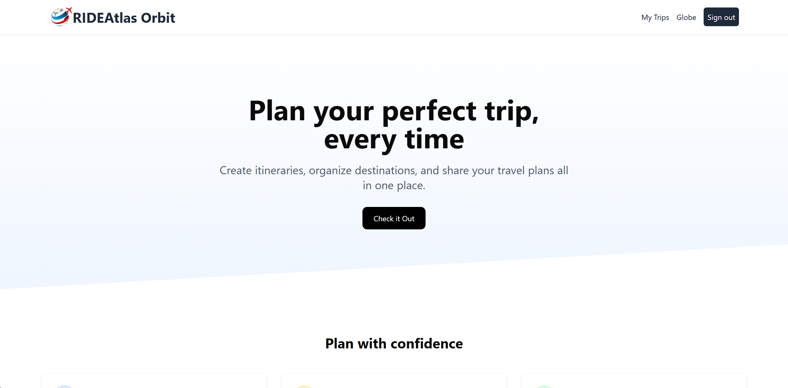

<div align="center">
  <br />
  <h1>🌍 RideAtlas-EX</h1>
  <p>
    <b>Prototype Global Trip Planner</b> — Featuring an interactive 3D globe, Google Maps APIs, and trip history visualization for a rich travel planning experience.
  </p>
  <br />
</div>

## 🚀 Overview

RideAtlas-EX is a **Next.js-based** prototype designed to explore the future of global trip planning.  
It integrates an **interactive 3D globe**, **Google Maps APIs**, and **dynamic trip history visualizations** to help users plan, visualize, and revisit their travel experiences in an intuitive way.

This is part of the broader **RideAtlas** vision — a modular travel planning platform built to eventually scale into a state-wise and global travel companion.

---

## ✨ Features

- 🗺 **Interactive 3D Globe** – Navigate and explore destinations from a global perspective.
- 📍 **Google Maps API Integration** – Search, visualize, and plan routes seamlessly.
- 📝 **Trip History Visualization** – View and relive your past journeys with engaging visuals.
- ⚡ **Next.js Performance** – Optimized routing, rendering, and performance out of the box.
- 🎨 **Modern UI** – Clean, responsive design for an immersive planning experience.

---

## 🛠 Tech Stack

- **Framework**: [Next.js](https://nextjs.org)
- **3D Globe**: Three.js / react-three-fiber (for visualization)
- **Maps & Places**: Google Maps JavaScript API, Places API
- **Styling**: Tailwind CSS
- **Hosting**: [Vercel](https://vercel.com)

---

## ⚡ Getting Started

1️⃣ **Clone the repository**

```bash
git clone https://github.com/yourusername/rideatlas-ex.git
cd rideatlas-ex
```

2️⃣ Install dependencies

```bash
npm install
# or
yarn install
```

---

3️⃣ Set up environment variables
Create a .env.local file in the root directory and add:

```bash
NEXT_PUBLIC_GOOGLE_MAPS_API_KEY=your_google_maps_api_key
```

4️⃣ Run the development server

```bash
npm run dev
# or
yarn dev
```

Your app will be available at: [http://localhost:3000](http://localhost:3000)

---

## 🖼️ Screenshots

## <div></div>

---

## ☁️ Deployment

### Deploy on Vercel

1. Push your code to GitHub
2. Go to [vercel.com](https://vercel.com)
3. Import your repository
4. Click **Deploy**

Your live website will be hosted on a custom subdomain (e.g. `https://your-name.vercel.app`)

---

## 🔗 Useful Links

- [React Documentation](https://reactjs.org/)
- [Tailwind CSS Docs](https://tailwindcss.com/)
- [Vite](https://vitejs.dev/)
- [Vercel](https://vercel.com/)

---

Let me know if you'd like me to generate a version with your actual GitHub repo, YouTube URL, or a banner image suggestion!
